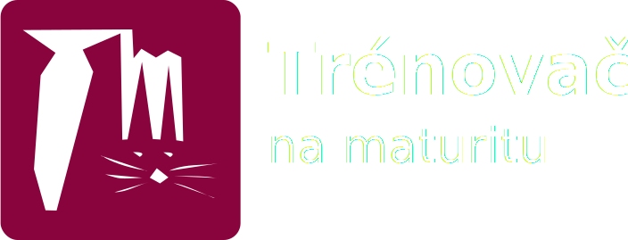
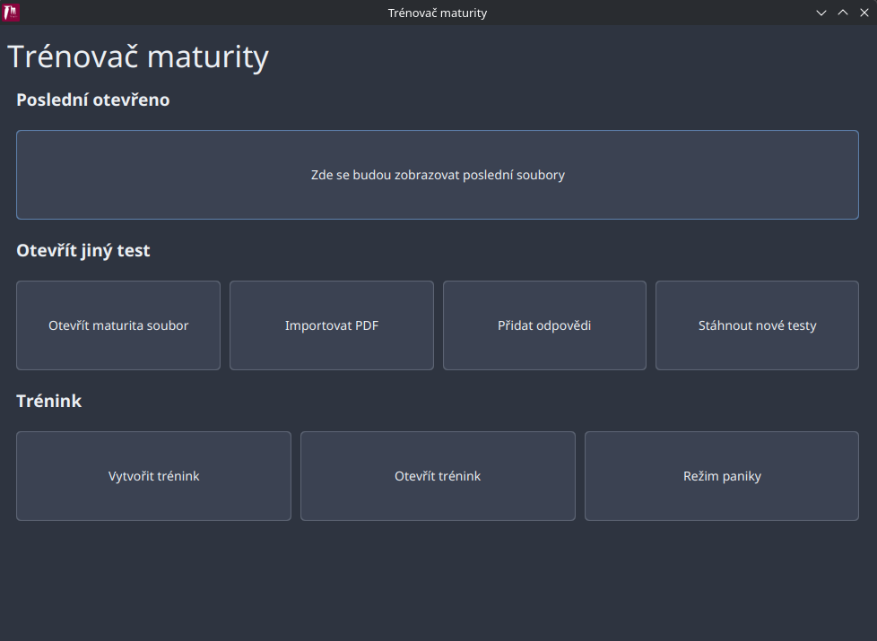
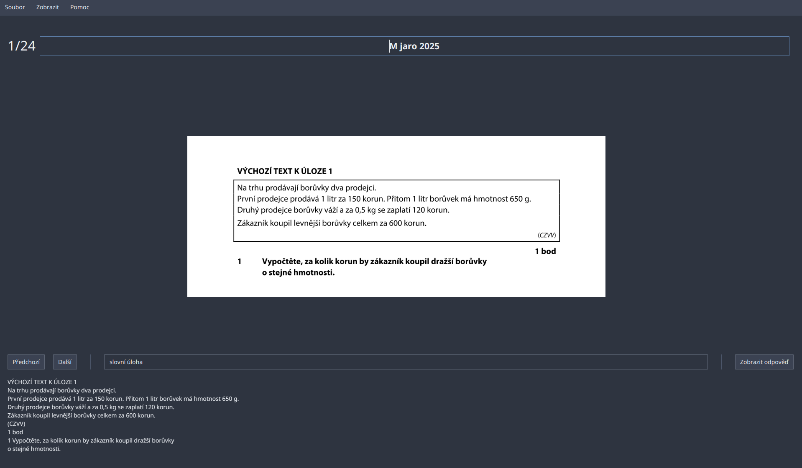
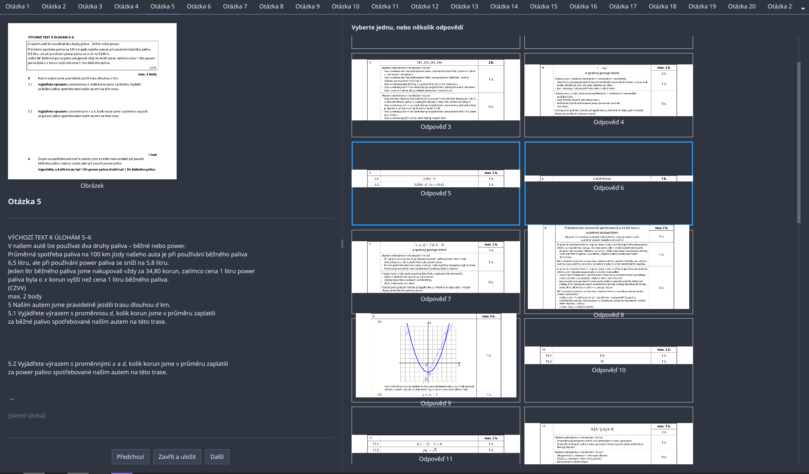
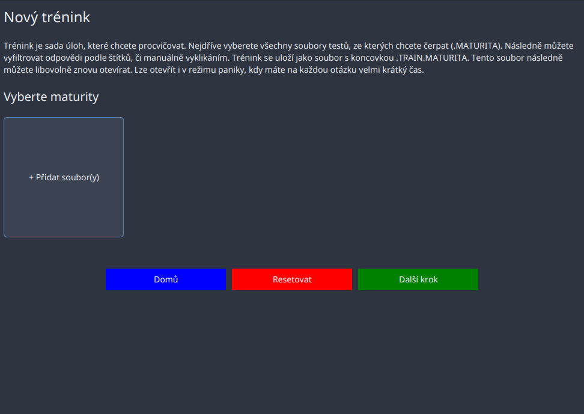

# 

Tento nástroj slouží jako pomocník pro trénování na maturitní zkoušku zadávané státem (CERMAT). Primárně je určen pro
maturitu z matematiky. Sám o sobě neposkytuje žádné testy, uživatel si je musí stáhnout sám a načíst jejich PDF do
programu. Program z těchto PDF extrahuje otázky a umožní vám je procvičovat, přidávat štítky, vytvářet tréninky a další.



## Instalace

**Installery**:
Ze stránky releases stáhněte installer.

**Linux**:
Instalační skript:
```bash
curl -s https://raw.githubusercontent.com/PanJohnny/trenovac-maturity/master/installer/linux.sh | bash
```

> [!NOTE]
> Oficiálně testované na Linuxu. Na Windows pak okrajově. Mělo by všude fungovat, ale může se stát, že narazíte na nějaké problémy. Pokud ano, neváhejte je nahlásit v issues.

### Build ze zdrojového kódu
Využijte Maven wrapper, který je součástí projektu. Spusťte tento příkaz v kořenové složce projektu:

Linux/MacOS:
```bash
./mvnw clean package
```

Windows:
```cmd
./mvnw.cmd clean package
```

Je potřeba sestavovat na cílové platformě.

## Klíčové koncepty

* štítky
    * slouží pro řazení otázek do určitých kategorií
    * např. slovní úloha, logaritmy, ...
    * můžete zadávat jakýkoliv text
    * odděluje je čárka `,`: `a, b, c`
    * můžete pomocí nich filtrovat otázky při tvorbě tréninku
* maturita soubor
    * soubor generovaný programem, končící příponou .maturita
    * obsahuje všechny data ke konkrétnímu testu, ne však původní PDF
    * zazipovaná složka, můžete otvírat jako `.zip`
    * speciální typ:
        * `.training.maturita`
            * může být kombinací několika různých testů
            * obsahuje otázky, odpovědi, ...
            * (otevřete tlačítkem `Otevřít trénink`)
* přidání odpovědí
    * proces při kterém importujete PDF `Klíč správných řešení`
    * program se pokusí toto udělat automaticky, ale nejde to kvůli tomu, že slovní úlohy můžou být roztahané do více
      úloh
    * manuálně pak projeďte automatické přiřazení a opravte chyby, kde chybí přiřazení opravte to
        * toto se musí udělat jenom jednou a pak už to bude fungovat
* režim paniky
    * po vybrání testů ze kterých se čerpají otázky
    * vybírá náhodně otázky a dává na ně krátký časový limit

## Využití

Cílem aplikace je pomoc s procvičováním na maturitní zkoušku, primárně z matematiky.

### Načtení testu z PDF

1. Ze stránek CERMATu si stáhněte test
2. Klikněte na Importovat PDF
3. Vyberte stažený soubor

Otevře se vám test a zároveň se v místě programu vytvoří soubor končící `.maturita`.



V tomto okně můžete nahoře upravit název testu (pozor: toto nezmění název souboru, který je automaticky odvozený z
informací). Pod obrázkem úlohy jsou tlačítka pro přecházení mezi úlohy, následně velké textové pole, do kterého můžete
zadávat štítky a tlačítko na zobrazení odpovědí.

Pro zobrazení odpovědí je třeba přidat odpovědi.

### Přidání odpovědí (dobrovolné)

1. Klikněte na tlačítko `Přidat odpovědi`
2. Vyberte PDF `Klíč správných řešení`
3. Vyberte k jakému testu chcete odpovědi přiřadit (musí být už zpracovaný jako .maturita)

4. Program se pokusí automaticky přiřadit odpovědi k úlohám, ale může se stát, že některé otázky budou rozdělené do více
   úloh, což způsobí, že některé odpovědi nebudou přiřazeny. V tomto případě je třeba manuálně přiřadit chybějící
   odpovědi.
5. Přiřazujete pomocí klikání na obrázky odpovědí. Modré rámečky označují přiřazené odpovědi (viz obrázek).
6. Uložte a vyzkoušejte.



Tlačítko zobrazit odpověď by mělo nyní fungovat a zobrazovat správné odpovědi.

### Tvorba tréninku

1. Klikněte na `Vytvořit trénink`
2. Vyberte testy, ze kterých chcete trénink vytvořit.
3. Pokud chcete vyfiltrujte otázky pomocí štítků.
4. Spusťte trénink. Bude uložený s příponou `.training.maturita` a můžete ho kdykoliv znovu otevřít.



## Upozornění

* PDF maturit a derivované soubory (.maturita) mohou podléhat autorským právům instituce CERMAT.
* Program není asociován s CERMATem a není oficiálním nástrojem pro přípravu na maturitu.
* Zdrojový kód je licencovaný pod GPLv3, před použitím se seznamte s licencí. Český překlad
  naleznete [zde](http://www.gnugpl.cz/v3/).
